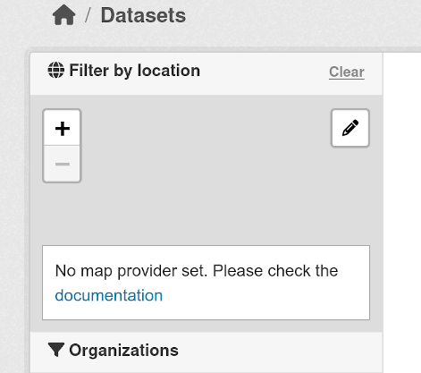

# Common base layers for Map Widgets

To provide a consistent look and feel and avoiding code duplication, the
map widgets (at least the ones based on [Leaflet](http://leafletjs.com))
can use a common function to create the map. The base layer that the map
will use can be configured via configuration options.

## Configuring the base layer

The map widgets use the
[Leaflet-providers](https://github.com/leaflet-extras/leaflet-providers)
library to make easy to choose the base tile layer that the map widgets
will use. You can use any of the supported providers, which are listed
in the [preview
page](http://leaflet-extras.github.io/leaflet-providers/preview/index.html).

!!! Note
    As of October 2023, most if not all of the tile providers require at
    least some form of registration and / or domain registering. They also
    have terms of use and will most likely require proper attribution (which
    should be handled automatically for you when choosing a provider).

If you haven't configured a map provider you will see the following
notice in the map widgets:

The main configuration option to manage the base layer used is
`ckanext.spatial.common_map.type`. The value of this setting should be
one of the provider names supported by Leaflet-providers, e.g.
`Stadia.StamenTerrain`, `Stadia`, `MapBox`, `Herev3.terrainDay`,
`Esri.WorldImagery`, `USGS.USImagery` etc. Note that these values are
**case-sensitive**.

Any additional configuration options required by Leaflet-providers
should be set prefixed with `ckanext.spatial.common_map.`, for instance
to configure the Stamen Terrain map that was used in previous versions
of ckanext-spatial:

    # Stadia / Stamen Terrain
    ckanext.spatial.common_map.type = Stadia.StamenTerrain
    ckanext.spatial.common_map.apikey = <your_api_key>

To use MapBox tiles:

    # MapBox
    ckanext.spatial.common_map.type = MapBox
    ckanext.spatial.common_map.mapbox.id = <your_map_id>
    ckanext.spatial.common_map.mapbox.accessToken = <your_access_token>

### Custom layers

You can use any tileset that follows the [XYZ
convention](http://wiki.openstreetmap.org/wiki/Slippy_map_tilenames)
using the `custom` type:

    ckanext.spatial.common_map.type = custom

You will need to define the tileset URL using
`ckanext.spatial.common_map.custom_url`. This follows the [Leaflet URL
template](http://leafletjs.com/reference.html#url-template) format (ie
{s} for subdomains if any, {z} for zoom and {x} {y} for tile
coordinates). Additionally you can use
`ckanext.spatial.common_map.subdomains` and
`ckanext.spatial.common_map.attribution` if needed (this one will also
work for Leaflet-provider layers if you want to tweak the default
attribution).

For example:

    ckanext.spatial.common_map.type = custom
    ckanext.spatial.common_map.custom_url = https://basemap.nationalmap.gov/arcgis/rest/services/USGSImageryOnly/MapServer/tile/{z}/{y}/{x}
    ckanext.spatial.common_map.attribution = Tiles courtesy of the <a href="https://usgs.gov/">U.S. Geological Survey</a>

### Old Stamen tiles

Previous versions of ckanext-spatial defaulted to using the
[Stamen](http://maps.stamen.com/) terrain tiles as they not require
registration. These were deprecated and stopped working on October 2023.
If you see this error displayed in your map widgets, you need to
configure an alternative provider using the methods described in the
sections above:

## For developers

To pass the base map configuration options to the relevant Javascript
module that will initialize the map widget, use the
`h.get_common_map_config()` helper function. This is available when
loading the `spatial_metadata` plugin. If you don't want to require
this plugin, create a new helper function that points to it to avoid
duplicating the names, which CKAN won't allow (see for instance how the
GeoJSON preview plugin does it).

The function will return a dictionary with all configuration options
that relate to the common base layer (that's all that start with
`ckanext.spatial.common_map.`)

You will need to dump the dict as JSON on the `data-module-map_config`
attribute (see for instance the `dataset_map_base.html` and
`spatial_query.html` snippets):

    
    

      

    

Once at the Javascript module level, all Leaflet based map widgets
should use the `ckan.commonLeafletMap` constructor to initialize the
map. It accepts the following parameters:

-   `container`: HTML element or id of the map container
-   `mapConfig`: (Optional) CKAN config related to the common base layer
-   `leafletMapOptions`: (Optional) Options to pass to the Leaflet Map
    constructor
-   `leafletBaseLayerOptions`: (Optional) Options to pass to the Leaflet
    TileLayer constructor

Most of the times you will want to do something like this for a sidebar
map:

    var map = ckan.commonLeafletMap('dataset-map-container', this.options.map_config, {attributionControl: false});

And this for a primary content map:

    var map = ckan.commonLeafletMap('map', this.options.map_config);
